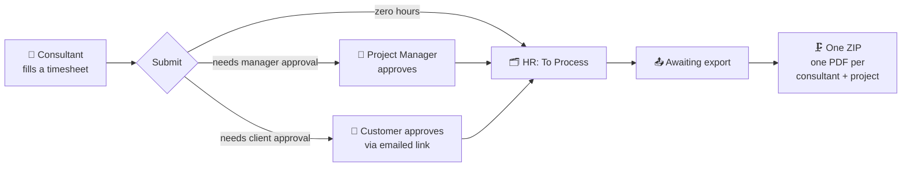
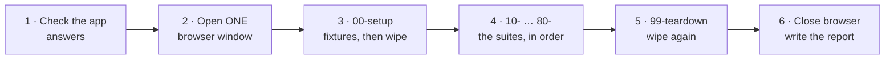
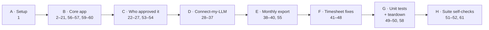

<div align="center">

# Titan Time — End-to-End Test Suite

**The automated test script for the Titan Time app.**
It drives a real browser through the real app — logging in, filling a timesheet, approving it,
downloading the export — and reports PASS or FAIL for every step.


</div>

---

Think of it as a checklist a robot works through, top to bottom, in about half an hour.
**This page is that checklist**, written in plain language — no technical background needed.

<table>
<tr><td><b>What it tests</b></td><td>The running Titan Time web app, through a real browser</td></tr>
<tr><td><b>How long</b></td><td>Roughly 30–45 minutes for all 51 steps</td></tr>
<tr><td><b>What it changes</b></td><td>Only the <code>e2e_*</code> test consultants' data — never real timesheets</td></tr>
<tr><td><b>Where it runs</b></td><td>Your machine, or GitHub, against local / dev / acceptance</td></tr>
<tr><td><b>Who reads this page</b></td><td>Anyone who needs to know what is and isn't covered</td></tr>
</table>

---

## Contents

| | Section | |
|---|---|---|
| 1 | [How a run works](#1-how-a-run-works) | What the conductor does |
| 2 | [**The script, step by step**](#2-the-script-step-by-step) | ⭐ All 51 steps |
| 3 | [Files that aren't part of the run](#3-files-that-arent-part-of-the-run) | Seeders, probes, quality check |
| 4 | [Settings the suite reads](#4-settings-the-suite-reads) | Addresses and logins |
| 5 | [Running it automatically](#5-running-it-automatically-on-github) | The GitHub workflow |
| 6 | [Known traps](#6-known-traps) | Why a PASS can lie |
| 7 | [Glossary](#7-glossary) | Every term used here |

---

## The journey being tested

Most steps below are one stop on this road. It helps to see the whole road first:



---

## 1. How a run works

`run-tests.sh` is the conductor:



1. **Checks the app answers** at the address given — stops immediately if not.
2. **Opens one browser window** and keeps it open for the whole run, so steps inherit each
   other's logged-in session. Deliberate, and it saves a lot of time.
3. **Runs every `verify-*.test.sh` under `suites/`, sorted by path.** The order is load-bearing,
   and the numbered folder names are what carry it:

   | Folder | What runs there |
   |---|---|
   | `00-setup/` | Ensure the projects/assignments exist, then wipe transactional test data |
   | `10-smoke/` | Login and the role landing pages |
   | `20-consultant/` | Timesheet entry, line items, attachments |
   | `30-approval/` | PM, manager and customer approval journeys |
   | `40-hr/` | HR dashboard |
   | `50-titan-manager/` | Titan Manager lists, search and dropdowns |
   | `60-email/` | Outbound mail |
   | `70-tickets/` | Per-ticket regressions (`tt647/`, `tt654/`, `tt683/`, `tt692693/`) |
   | `75-export/` | Corrections after an export has gone out |
   | `80-platform/` | Unit-test module, and the suite's checks on itself |
   | `99-teardown/` | Wipe again |

   Previously this was a flat alphabetical sort, which worked only because `-` sorts before `0`
   — so `verify-00-fixtures` happened to precede `verify-000-testdata-clear-before`. The folders
   make that intent explicit instead of incidental.
4. **Marks a step FAILED if it exits non-zero**, prints its output, and saves a screenshot named
   `<step>-failure.png` so you can see what the page looked like.
5. **Gives up on a step after 2 minutes** (`--timeout` to change), so one hung page can't stall the run.
6. **Writes a `results.xml` report** when asked (`--junit`) — that is what GitHub reads.
7. **Closes the browser** at the end, whatever happened — and on Ctrl-C it stops the run
   instead of carrying on against a session it just closed.
8. **Refuses to start if the number of steps is not what you expected** (`--expect-count N`).
   Without it the run itself cannot fail: rename a step out of the `verify-*.test.sh` pattern
   and the conductor reports "3 steps: 3 passed" and exits happy. CI should always pass it.

> [!NOTE]
> `ci-skip.txt` lists steps to skip on a given environment. It is **empty on purpose** — entries
> get added only when a real run proves a step can't work there, each with a written reason.

---

## 2. The script, step by step

All 63 steps, grouped into eight blocks.

> [!NOTE]
> One step, `verify-timesheet-locks-after-submit` (added in `f885008`), is not written up
> below yet. The count above includes it; the walkthrough does not.

> [!IMPORTANT]
> The numbering below still reflects the old flat alphabetical run order. Tests now live in
> `suites/` folders (see section 1) and run in folder order, so **the numbers no longer match
> execution order**. Every description is still accurate; only the sequence changed.



**Tags used below**

| Tag | Meaning |
|---|---|
| `read-only` | Looks, changes nothing |
| `consumes 1` | Uses up a piece of test data; makes a fresh one if none is waiting |
| `seeds data` | Exists to create data for later steps, not to assert anything |
| `always passes` | Reports findings for a human; never fails the run |
| `needs fixture` | Requires specific data to exist beforehand |
| `TT-000` | The Jira ticket this step proves |

<br/>

<details open>
<summary><h3>Section A — Setup &nbsp;·&nbsp; step 1</h3></summary>

**1. `verify-000-testdata-clear-before` — Wipe the slate.** &nbsp; `seeds data`

Logs in as the administrator and, for each test consultant, clears their timesheets, entries,
tasks, attachments, expense reports, PDFs, approvals, history and approval emails. Projects,
customers and accounts survive, and nobody else's data is touched.

*Why:* every later step then starts from a known-empty state instead of inheriting last run's
leftovers.

</details>

<details>
<summary><h3>Section B — Core app behaviour &nbsp;·&nbsp; steps 2–21, 56–57 and 59–60</h3></summary>

These used to run alphabetically, which is why the topics interleave below. They are now grouped
by suite folder instead; the descriptions are unchanged.

**2. `verify-anon-bad-token` — A bad approval link is refused.** &nbsp; `read-only`

Customers approve timesheets through an emailed link containing a 44-character token. This opens
that link with a deliberately invalid token, while logged out, and confirms the app bounces you to
the login page instead of showing the approval screen. No login needed.

**3. `verify-assignment-dropdowns-sorted` — Add Assignment dropdowns are alphabetical.** &nbsp; `TT-662` `read-only`

As Titan Manager, opens Add Assignment and walks the cascade — choose a Customer, which fills
Project, which fills Consultant — checking Project and Consultant come back in A–Z order. Nothing
is saved.

**4. `verify-consultant-line-items` — Task rows add up (the reliable half).**

On a project that requires a task breakdown: expands the tasks section, adds a task, types Mon–Fri
hours and confirms that task's own total is right; edits a cell and confirms the total follows;
adds a second task; deletes them again.

> [!NOTE]
> The *row-level* rollup is deliberately **not** asserted here — it is known to be flaky (TT-692)
> and is covered separately in step 43.

**5. `verify-consultant-reminder-mail` — A reminder email genuinely arrives.**

As administrator, uses the Email Tester to send the consultant submission-reminder to an inbox the
suite owns, then **reads the delivered message back** and checks its subject and body. That proves
the whole chain — compose, send, deliver — not just that a button exists.

**6. `verify-consultant-timesheet-crud` — Save Draft really saves.**

Types hours into a day cell, clicks Save Draft, then navigates a week back and forward to force the
app to re-read from the database, and confirms the number survived. Then edits it and confirms the
new value replaced the old one. Never submits, so the week stays reusable.

*Known gap:* the **Clear** button is not covered — it blanks the box without saving the blank.

**7. `verify-consultant-timesheet` — The consultant's main screen loads.** &nbsp; `read-only`

Logs in as a consultant and confirms the weekly grid shows its columns: Project, Client, Sun…Sat,
Total.

**8. `verify-customer-approval-flow` — The whole customer email journey.**

As HR, presses **Remind** on a pending client-approval entry (reminding does not consume it; if
none is waiting, a consultant submits one first). Reads the resulting email, pulls the approval
link out of it, opens that link **logged out**, and confirms the page shows the right customer's
pending timesheets — and no one else's. The entry is left un-approved, so the step can run again.

**9. `verify-emailprep-apply` — Redirect an environment's outbound email.** &nbsp; `read-only` by default

A maintenance utility, not a behaviour test: it rewrites recipient addresses on accounts and
projects so a test environment can't email real clients. **Reports only** unless `EMAILPREP_APPLY=1`
is set.

**10. `verify-emailprep-probe` — Identify two unlabelled icons.** &nbsp; `read-only`

A read-only investigation supporting step 9. Two icon-only links sit side by side on a project row
with no labels; this reads their icon classes to tell Edit from Delete rather than clicking one to
find out.

**11. `verify-hr-dashboard-summary` — The stage counters actually count something.** &nbsp; `read-only`

Confirms the workflow sections render, and — the part that matters — that all six stage counters
are present, show a number, and are not all zero.

It used to assert four section captions, one of which was the very text the login had just waited
for. That assertion was free, and none of the four touched the aggregation the step existed to
check. Now the captions it asserts exclude the one the login proves, so they can fail; and the
counters are checked directly.

All six counters come from a **single retrieve**, filtered five ways, so all-zero is what that one
retrieve failing looks like — the failure that takes out the whole summary at once. Earlier steps
leave entries behind, so an empty summary here means broken rather than idle.

It stops short of asserting that a counter matches the list on its own tab: the counters may be
scoped by month or week while a tab shows one week, and demanding they match would produce a
confident, wrong failure. That needs one look at a running dashboard.

**12. `verify-hr-sent-consultant-sorted` — Sent-tab filter is alphabetical.** &nbsp; `TT-667` `read-only`

**13. `verify-manager-approval-flow` — Manager-approval work reaches the right queue.**

Confirms an entry on a manager-approval project lands in the assigned Project Manager's queue (not
the customer email flow), and that the PM dashboard shows it with Approve / Approve All.
Deliberately does **not** approve, so the entry survives for the next run.

**14. `verify-pm-approve-action` — Approve actually works.** &nbsp; `TT-691` `consumes 1`

The regression guard for a real bug where pressing Approve threw a server error. Makes sure a
pending entry exists, clicks Approve, and asserts **no error appears** and the entry has left the
queue after a refresh.

**15. `verify-pm-dashboard-pending` — The PM sees their project and its queue.** &nbsp; `read-only`

The managed project shows with its details, and the Pending Approval section lists submitted
entries with its buttons. Does not click Approve.

**16. `verify-project-dropdowns-sorted` — New Project dropdowns are alphabetical.** &nbsp; `TT-660` `read-only`

**17. `verify-role-dashboards` — Each of the four roles lands on its own home page.** &nbsp; `read-only`

Logs in as consultant, PM, HR and Titan Manager in turn, clearing cookies between each.

**18. `verify-smoke-login` — Basic login works.** &nbsp; `read-only`

Signs in as the administrator through the standard login form and confirms the Admin Hub loads.
Uses forms login on purpose, so the identical test runs locally, on dev and on acceptance.

**19. `verify-timesheet-attachment` — A file can be attached and stays attached.**

As a consultant, opens a timesheet row's attachment screen, uploads a real file through the
browser's file dialog, saves, reopens, and confirms the file is still listed. Adds one attachment
per run.

**20. `verify-tm-customers-sorted` — The Titan Manager customer list is alphabetical.** &nbsp; `TT-674` `read-only`

**21. `verify-tm-search-as-you-type` — Search filters while typing.** &nbsp; `TT-682` `read-only`

Types part of a customer name and confirms the list narrows on each keystroke without pressing
Enter, and that the expected match is shown.

**56. `verify-hours-validation` — The limits on what you can enter.** &nbsp; `consumes 2 weeks`

Every other step in the suite submits exactly forty hours, so the over-limit branch had never
once fired in a test run. That left the warning popup and its **Submit Anyway** override with no
coverage at all.

Four checks. Forty-five hours must raise the warning, and **Cancel must leave the week
unsubmitted** — a warning you can dismiss into a silent submit would be worse than no warning.
Submit Anyway must then genuinely submit. And a day of twenty-five hours, or of minus five, must
not be accepted in silence.

Those last two are deliberately phrased as *not silently accepted* rather than naming a
particular error. Whether the field refuses the keystrokes, a validation message appears, or a
popup intervenes is a design detail that may change; that **something** stops it is the actual
rule. A step demanding one specific surface would go red on a harmless redesign and tell you
nothing about whether the rule still held.

*Why this layer:* the twenty-four-hour arithmetic is already pinned down by three unit tests, so
this does not re-test it. The popup, its two buttons and the override exist only in the UI, and
nothing but a browser can reach them.

**57. `verify-timesheet-clear` — Clearing a week empties it, and empty is not zero.** &nbsp; `consumes 2 weeks`

Blank and `0` are different things here. A blank day means *nothing recorded*; a `0` means *worked
none, and I am telling you so*. They drive different behaviour downstream, and the Clear action
carries a note from its own author calling the distinction "delicate" — which is exactly the kind
of rule that rots unnoticed, because a regression writing `0.00` instead of blank looks identical
on screen.

Three checks. After Clear every day cell must be **exactly empty**, not `0` and not `0.00`. An
explicit `0` must survive a save and reload **as a zero**, which taken with the first check is what
proves the two states are genuinely distinct rather than one being a rendering of the other. And
Clear must be **refused** once the week is no longer editable — clearing a submitted week would
silently destroy hours somebody had already approved.

*Why it reads raw values:* the suite's week-finder deliberately treats `''`, `'0'` and `'0.00'` as
interchangeable when hunting for a usable week — correct for that job, useless for this one. This
step reads the fields itself rather than borrowing that notion of "blank".

**59. `verify-email-templates-present` — Every email type has a template behind it.** &nbsp; `sends 11`

The wording of each email is not in the model. It lives in database rows, configured per
environment. When the row for a type is missing the send loop simply **breaks** — no error, no
warning in the log, no queued message. The email just never happens. That is the likeliest way
email silently stops working on a fresh or restored environment, and nothing tested it.

So this sends all eleven types from the Email Tester, giving each a **distinct recipient derived
from the type name**, then reads the Emails Sent page once. A type whose template is missing
produces no row, and the per-type address is what says *which* one. Counting eleven rows would
only prove eleven arrived; addressing them by type turns "email is broken" into
"`ToManager_HoursNotice` has no template".

It does not prove the wording is right, or that anything was delivered — only that a template
exists and a message was raised. Delivery is the send event's job, on its own schedule.

**60. `verify-consultant-data-isolation` — One consultant cannot read another's hours.** &nbsp; `read-only`

A read of the security model found that the timesheet-entry entity has **no XPath constraint** for
the consultant role. What actually keeps a consultant to their own rows is the XPath on the pages
and microflows that fetch them. That is real protection for anyone using the app through its
screens — but it is a single layer, and it is the layer no test exercises, because every other step
here goes through those same screens and would look identical either way.

So this asks the data layer directly, as an ordinary logged-in consultant, using the app's own
client API. Not tooling and not an exploit: the same call the app itself makes, with a different
filter.

The care is in making a zero mean something. "Consultant A retrieved none of B's entries" is only
reassuring if B *has* entries to retrieve, so the step first proves as administrator that the very
same query returns rows. If the control comes back empty the run **aborts** rather than passing —
otherwise this would be a check that passes hardest against an empty database.

If it fails, the fix belongs on the entity access rule, not on any screen.

</details>

<details>
<summary><h3>Section C — "Who approved this?" &nbsp;·&nbsp; steps 22–27 and 53–54 &nbsp;·&nbsp; TT-647 / TT-649</h3></summary>

The To Process card must name the approver **and their role**, and must never imply the wrong
person approved. Each step drives a different route to that one sentence.

| Route taken | The card must read |
|---|---|
| PM approved it | `(Project Manager)` |
| HR stood in for the client | `(HR/Titan Manager, on behalf of Client)` |
| HR stood in for the PM | `(HR/Titan Manager, on behalf of Project Manager)` |
| No approval was needed | `No approval required` |
| Both stages approved | **two** lines, manager stage first |

**22. `…-a1-pm-approver-line` — PM approval reads "(Project Manager)".** &nbsp; `consumes 1`

Consultant submits → PM approves → the card must show `Approved by <PM name> (Project Manager) on
<date>` on line 1, with line 2 empty because there is no client stage.

**23. `…-a2-hr-on-behalf-of-client` — HR standing in for the client says so.** &nbsp; `consumes 1`

HR approves a client-approval entry from the dashboard instead of the customer clicking their email
link. The line must read *"(HR/Titan Manager, on behalf of Client)"* — never *"(Client)"*.

**24. `…-a3-no-approval-required` — No approval step reads "No approval required".**

A zero-hour week skips approval entirely. The card must say so, rather than crediting the
consultant with approving their own timesheet.

**25. `…-a4-other-tabs-clean` — The approver text appears on one tab only.** &nbsp; `read-only`

All four HR tabs share one underlying template, so a careless edit can leak these lines onto
Manager Approval, Client Approval or Sent. This confirms they appear only on To Process.

**26. `…-a5-dual-approval-two-lines` — Two approvals show two lines.** &nbsp; `needs fixture` `consumes 1`

A project needing both PM *and* client approval: consultant submits → PM approves → HR approves the
client stage → the card must list **both** approvers, manager stage first.

> [!WARNING]
> This step **fails loudly rather than skipping** when the dual-approval fixture project is missing.
> A silent skip would mean the two-approver requirement is never actually proven.

**27. `…-a6-hr-on-behalf-of-pm` — HR standing in for the PM says so.** &nbsp; `consumes 1`

The mirror of step 23 at the manager stage: the line must read *"on behalf of Project Manager"*.
This was the one wording variant with no coverage.

**53. `verify-customer-token-approve` — The client actually approves.** &nbsp; `consumes 1`

Step 26 walks the whole emailed-link journey and then stops one click short, on purpose, so it can
run again and again against the same standing entry. That left the app's only path where an
unauthenticated visitor *writes* something with nothing testing it. This one presses the button.

It then checks the two things a click alone does not show: that the entry actually arrives in **To
Process**, and that the approver is recorded as the **client** rather than as HR acting on their
behalf. Asserting only that the entry left the queue would pass just as happily if it had been
rolled back or deleted.

Unlike step 26 this consumes an entry, so it reminds a pending one when there is one and creates
its own when there is not.

*Why:* five separate strands of the coverage audit — pages, business logic, roles, the status
lifecycle, and the written scenarios — each independently landed on this as the biggest hole.

**54. `verify-customer-token-reject` — The client rejects, and must say why.** &nbsp; `consumes 1`

The other half of step 53. Rejection is how a wrong timesheet gets corrected, and until now it
appeared in the suite only as un-asserted setup — something rejects an entry so a later step has
one to resubmit. Nobody checked that the *client* can reject, or that rejecting does what it says.

Two assertions. First the guard: pressing Reject with an **empty comment** must do nothing. The
rejection flow branches on whether a comment was left, and that branch is the reason a rejection
always reaches the consultant with a reason attached. Second the transition: with a reason typed
in, the entry leaves the client's queue *and* reappears in the consultant's **Rejected Entries**.
Checking only that it left would pass for a rollback just as happily.

*Why:* a silent regression in the comment guard would turn every rejection into a mystery for the
consultant, and nothing else in the suite would notice.

</details>

<details>
<summary><h3>Section D — Connect-my-LLM &nbsp;·&nbsp; steps 28–37 &nbsp;·&nbsp; TT-654</h3></summary>

Titan Time can be driven by an AI assistant over an authenticated connection. These steps cover
that feature, plus the timesheet submit paths it shares with the app.

**28. `…-a0-seed-testdata` — Set up draft weeks.** &nbsp; `seeds data`

Not an assertion — data preparation. Leaves editable draft entries covering all three project
shapes (customer approval, manager approval, task breakdown) and records the week it used.

**29. `…-a1-token-generate` — A consultant can create their access token.**

The raw token is shown **exactly once**; the app stores only a scrambled copy. If this button
breaks there is no other way to connect. Checks the button exists and produces a token-shaped value.

**30. `…-a2-page-submit-regression` — The weekly Submit button still works.**

Covers the main timesheet Submit path end to end. *The file's own header records that its original
scope claim was wrong, and what it genuinely covers now.*

**31. `…-a3-lineitems-submit` — Resubmitting a task-breakdown timesheet.**

Drives the one button in the whole app wired to the shared submit routine, on a project that
requires a task breakdown — the branch that copies the task list onto the history record.

**32. `…-a4-mcp-tools` — The four AI tools, end to end.** &nbsp; `consumes 1`

The centrepiece. In order:

| # | Assertion |
|---|---|
| 1 | A fake token is rejected |
| 2 | A real token lists all four tools |
| 3 | Assignments come back as real projects |
| 4 | The seeded draft week is reported correctly |
| 5 | Writing hours saves and totals correctly |
| 6 | Re-reading shows the write really persisted |
| 7 | Submitting works |
| 8 | Afterwards, further writes are refused |

**33. `…-a5-manager-approval-branch` — Manager-approval routing on weekly submit.**

Every other step here submits a customer-approval project, so without this the "goes to the
manager" branch would never be exercised. Wrong routing would silently send timesheets to the wrong
approver — worse than an error.

**34. `…-a6-mcp-token-scoping` — One consultant's token only ever sees their own data.**

The security property the whole design rests on. Creates a token for each of two consultants and
proves their visible project lists have nothing in common.

**35. `…-a7-mcp-lineitems-refused` — The assistant refuses task-breakdown projects.**

Tasks can't be entered over the connection, so submitting such a week would send an incomplete
timesheet. Confirms it is refused, that the entry is **still editable afterwards** (so the refusal
happened *before* submitting, not after), and that a normal project still submits fine.

**36. `…-dev-account-probe` — Report what the test consultant is assigned to.** &nbsp; `read-only`

**37. `…-dev-build-probe` — Report how recent the deployed build is.** &nbsp; `read-only`

</details>

<details>
<summary><h3>Section E — The monthly export &nbsp;·&nbsp; steps 38–40 and 55 &nbsp;·&nbsp; TT-683 / TT-652</h3></summary>

**38. `…-a0-seed-awaiting-export` — Push entries to "awaiting export".** &nbsp; `seeds data`

Nothing else in the suite produces them, so without this the export steps either failed outright or
silently tested other people's data. Processes what is on the To Process tab and seeds more until at
least two different consultant + project pairings are waiting.

**39. `…-a1-zip-one-pdf-per-assignment` — One PDF per consultant/project, in one ZIP.**

The core promise. Previously the whole batch produced a **single** PDF headed by whichever pairing
happened to be processed last. Downloads the archive and checks:

- it really is a ZIP;
- it holds at least one entry, and every entry name is distinct;
- with more than one entry, the consultant/project groups genuinely differ;
- **the PDFs differ in content**, not just in filename ← the assertion that actually pins the fix.

**40. `…-a2-filename-standard` — Every PDF is named to the agreed pattern.**

```text
{year}-{MMdd of month END}-{Last First}-{Project}.pdf
2026-0630-Urech Thomas-Interstates Gizmo.pdf
```

> [!CAUTION]
> The riskiest part is the **day**. A timezone slip turns a 30 June month-end into `0629`.
> Step 4 of this test catches exactly that.

**55. `verify-hr-reject-after-export` — Taking back a week that has already gone out.** &nbsp; `consumes 1`

Once a week is exported it has, in practice, been invoiced, and this is the only route back. The
flow is supposed to do two things: set the entry to rejected, **and** subtract its hours from the
assignment's running total.

The subtraction is what this really guards. If it silently stopped, the entry would still visibly
leave the tab, every ordinary check would pass, and the assignment would over-report hours worked
for the rest of its life. So the step reads the entry's hours off the card, reads the assignment
total before and after, and requires the difference to match exactly — reporting the "rejected but
total unchanged" case in those words, because that is the failure that would otherwise hide.

It runs here, after the TT-683 steps, because the only way to reach the exported state is Process
followed by Export All — and Export All exports everything awaiting export on the environment.
Reusing what those steps already exported avoids setting that off from an earlier block. It can
still drive the chain itself if nothing is available, and says so loudly when it does.

</details>

<details>
<summary><h3>Section F — Timesheet usability fixes &nbsp;·&nbsp; steps 41–48 &nbsp;·&nbsp; TT-692 / TT-693</h3></summary>

**41. `…-a1-focus` — The Tab key doesn't throw you off the page.** &nbsp; ⭐ *the headline fix*

On a brand-new week the grid used to rebuild itself on the first keystroke and lose your cursor
entirely. This must run on a week never opened before, which the step enforces. It passes only if
focus is still inside the grid after each Tab.

**42. `…-a2-c6-observational` — Two things to eyeball, not to gate on.** &nbsp; `always passes`

Reports whether browsing weeks litters the history with empty drafts, and whether resubmitting
records a real status change. Prints findings for a human to read.

**43. `…-b1-lineitem-rollup` — Task totals roll up without erroring.** &nbsp; `TT-692`

The failure signals are a row total stuck at `0.00` while the task total shows a number, or a server
error on the first edit of a new entry. Known residual flakiness on already-settled entries is
reported separately as `RESIDUAL` rather than failing the step.

**44. `…-c1-resubmit` — A rejected timesheet can be fixed and resent.** &nbsp; `TT-693` `consumes 1`

Checks all of:

- the Review & Edit popup closes on Resubmit;
- the entry leaves the Rejected list **without a manual refresh**;
- it is still gone after a reload;
- it arrives in the Manager Approval queue;
- the week totals reflect the **edited** hours (the reported symptom was stale sums).

**45. `…-c2-zero-hours` — A zero-hour resubmit goes to HR, not to a manager.**

The entry used to *display* "Awaiting Manager Approval" while actually sitting in HR's queue. This
checks the status shown **and** the queue it lands in, and that the two agree.

**46. `…-c3-no-double-submit` — You can't submit the same thing twice.**

Resubmits once, then tries again from the stale screen. The second attempt must be refused with a
message, and the approval queue must hold exactly **one** item — the old bug created a duplicate.

**47. `…-c4-lineitem-popup` — Day boxes lock when tasks drive the numbers.**

On a task-breakdown project the review popup must show the day boxes as read-only and offer a task
editor instead, with corrections flowing back into the day values and totals.

**48. `…-c5-cancel` — Cancel really cancels.**

Typing in the review popup used to save on leaving the field, so Cancel didn't undo it. Types a
value, cancels, and confirms the original numbers are back. Never resubmits.

</details>

<details open>
<summary><h3>Section G — Unit tests, model checks and teardown &nbsp;·&nbsp; steps 49–50 and 58</h3></summary>

**49. `verify-unittests` — Run the app's own internal tests.**

Triggers the Mendix UnitTesting suite inside the running app and reports each failure with its last
progress message — the only free-form text that endpoint returns.

> [!CAUTION]
> That endpoint is **password-only with no session**. Keep it enabled on local configurations only,
> never in a cloud environment.

**50. `verify-zzz-testdata-clear-after` — Wipe the slate again.**

Identical to step 1. Leaves the environment as it was found, so this run's data can't skew the next
one. If teardown fails, **the whole run is marked failed** — silently leaving data behind is what
makes the *next* run's failures impossible to read.

**58. `verify-scheduled-event-config` — The reminders still fire when they should.** &nbsp; `read-only` `no app needed`

Scheduled events are invisible to every other kind of test. No browser can see them, the runtime
does not expose them, and no unit test can reach them. A regression in *when* they fire would
surface weeks later as "the reminders went out at the wrong time" — to customers.

So this reads the model on disk and pins the timing fix of 2026-08-19: the three weekly reminders
fire at **14:00**, because Mendix Cloud runs the scheduler in UTC. It also pins the thing that was
deliberately **not** changed — `Assignment_VerifyHours` stays monthly at **00:00**, because it is a
data job rather than a message to a person, and moving it would shift which month's hours get
verified. Those two settings look identical and are not, which is exactly how a well-meaning
tidy-up breaks one of them. Two documents in the repo still describe the old 09:00 timing, so the
wrong value is already written down somewhere and will be believed.

It also checks all five first-party events still run through their `_Guarded` wrapper — the thing
that stops them acting for real on a test environment.

*Two honest limits.* The **timezone** property itself is not readable by the format reader, so only
the hour is pinned; the step says so rather than implying coverage it lacks. And it reads the
**last saved** model, so an unsaved change in Studio Pro is invisible to it.

Needing no app makes this the one step you can run any time, in seconds. It is skipped in CI only
because the model is not checked out beside the suite there.

</details>

<br/>

<details open>
<summary><h3>Section H — The suite checking itself &nbsp;·&nbsp; steps 51–52 and 61</h3></summary>

Both steps exist because of one discovery: the two traps in section 6 were found by an audit,
not by a failing test. A trap only a human can spot will come back. These make the suite fail on
its own behalf.

**51. `verify-no-echo-trap` — No assertion may match its own question.** &nbsp; `read-only`

Scans every script for the echo trap: asking the browser something and then searching the raw
output for the answer, where the answer also appears in the question. Fails the run and names
each offending line. Needs no browser, so it is quick and works anywhere.

Before trusting a clean scan it checks its own detector against a known-bad and a known-good
example. A detector that quietly stopped detecting would otherwise turn this step into exactly
the kind of always-green check it exists to prevent.

*Why:* the trap is documented in three places and still reached six live call sites. A comment
cannot fail a build.

**52. `verify-helper-selftest` — The shared helpers must still be able to fail.**

The runtime half of step 51. The click helper underneath every tab switch in the suite once
could not fail, so a caption that did not exist still "clicked" and the step then asserted
against whatever tab was already open. This proves the decoder is sane, that the click helper
both clicks a real element *and* actually lands the click, that it fails on a caption that
cannot exist, and that `tt_fail` still exits non-zero.

It injects its own clickable element rather than relying on a real caption, so it needs no
login, cares about no particular page, and does not break when a dashboard is redesigned.

*Why:* a green suite only means something if its helpers can go red.

**61. `verify-session-identity` — When a step says it is logged in as someone, it really is.**

The suite shares one browser session across every step and caches a login per identity. That cache
used to be accepted on **landing text alone**: replay the cookie, look for a phrase, carry on. Which
is not proof of identity. Two roles can share a phrase, and a replayed cookie belongs to whoever was
logged in when it was written — so a cache hit could hand a step the wrong user while looking
perfectly healthy, and everything after it would be describing somebody else's data.

That is a nasty failure because it does not look like one. Nothing goes red; the results are just
about the wrong person. Every role-scoped step depends on this, and step 60 in particular is
meaningless if the session is not who it claims.

The login helper now checks **who the session actually belongs to**, not just where it landed. This
step proves that it does, by logging in as each role in turn and asking the app who it is — ending
by returning to the first identity, because the return trip is what goes through the cache rather
than a fresh login.

*Why the loop reads from a here-document:* a piped `while` runs in a subshell, so every failure it
counted would be thrown away on the way out and the step would pass whatever it found. That is the
exact bug class Tier 0 existed to remove, and it would have been embarrassing here of all places.

</details>

---

## 3. Files that aren't part of the run

The conductor only picks up files ending in `.test.sh`. Everything else here is run by hand.

| File | What it is |
|---|---|
| `seed-shakedown.sh` | **Run this first, always.** A read-only preflight: is the app up, do the logins work, how slow is a round-trip, and — critically — *which weeks can hold data at all*. Skipping it is how a whole data set once got built on weeks that render no rows. |
| `seed-regression-ladder.sh` | Builds a wide manual-testing data set: entries in every status across many hour scenarios. Destructive, and deliberately not named `.test.sh`. |
| `seed-toprocess-entries.sh` | Narrower ancestor of the above — fills the HR *Weekly To Process* tab by walking real approval chains rather than taking the zero-hour shortcut, so the cards look like genuine timesheets. |
| `verify-toprocess-count.sh` | Reports what is actually on the To Process tab by counting cards, rather than trusting the seeder's own tally. Asserts nothing. |
| `quality/check-app.sh` | Runs Studio Pro's own consistency check from the command line and compares it with a recorded baseline. Exit `0` = no worse than baseline, `1` = new problems. Reads the **last saved** file on disk, so unsaved edits are invisible to it. Marketplace warnings are suppressed so the ones that are ours aren't drowned out. |
| `MANUAL-MCP-TEST-SCRIPT.md` | Prompts to type into an AI assistant connected to the app — the human half of the TT-654 testing. |
| `tools/mail-selfcheck.sh` | Proves the suite can *read* mail, by opening the app's Emails Sent admin page and reporting what it sees. If this passes but an email step fails, the app did not raise the message — the plumbing is fine. |
| `lib/*.sh` | Shared building blocks (logging in, resetting data, per-ticket fixtures). Not tests; each header explains the traps it exists to avoid. |

### Reading email

Several steps need to read an email the app just sent. They read it from **the app's own admin
page** — "Emails Sent" on the administrator homepage — which lists every message the app has
produced with its recipient, subject, status and body.

There is nothing to install or configure. This replaced an external mail catcher — a fake SMTP
server — that only ever worked on a laptop: the *app* has to reach a catcher over SMTP, so testing a cloud
environment would have meant a publicly reachable host with an open SMTP port and a secret in
CI. That was the only thing CI needed beyond the app itself, and it was never set up.

Two things the admin page gives that the catcher could not: the recipient is a column, so mail
going to the **wrong address** is detectable; and messages are visible while still *queued*,
before the send event runs, so a step need not wait for delivery to prove a mail was raised.

Freshness comes from a **high-water mark** rather than an emptied inbox — the suite notes which
messages already exist before triggering the action, and only considers newer ones. Nothing is
deleted, so this is safe on a shared environment.

The cost: the page is administrator-only, so reading mail ends whatever role session a step was
using. Details in [`tools/README.md`](tools/README.md).

---

## 4. Settings the suite reads

| Setting | Meaning |
|---|---|
| `TT_BASE_URL` | Which app to test, no trailing slash. Defaults to localhost |
| `TT_ADMIN_USER` / `TT_ADMIN_PASS` | Administrator login |
| `TT_ROLE_PASS` | Password shared by the four `e2e_*` role accounts |
| `TT_E2E_CONSULTANTS` | Which consultants the wipe steps are allowed to clear |

> [!WARNING]
> In GitHub these come from repository secrets. The defaults built into `lib/_login.sh` are a local
> convenience and **must never be relied on** against a deployed environment.

---

## 5. Running it automatically on GitHub

`.github/workflows/e2e.yml` runs the suite on GitHub's machines:
**Actions → E2E → Run workflow**, optionally typing an app address.

Each run installs the tools and Chromium, runs the suite with a report and the skip list, and
uploads `results.xml` plus any failure screenshots as downloadable artifacts (kept 30 days). Only
one run happens at a time, because the suite changes shared data on the target environment.

> [!NOTE]
> It is **manual-trigger only** right now. A weekly schedule is written but commented out on
> purpose: the suite has never had a recorded clean run, and a build that is always red teaches
> everyone to ignore it. Switch the schedule on after one clean baseline.

---

## 6. Known traps

> [!WARNING]
> Both traps below produce a **test that passes when it shouldn't** — the worst possible outcome,
> because nobody investigates a green result.

1. **The echo trap.** Asking the browser a question and then searching the raw output for the answer
   can match the *question being echoed back* rather than the answer. Use the decoding helper in
   `lib/_login.sh` instead of searching raw output.
   **Now guarded:** step 51 (`verify-no-echo-trap`) fails the run on any new occurrence, with no
   browser needed.
2. **Assertions that cannot fail.** Treat an unexpected PASS as suspicious until you have broken the
   check on purpose and watched it go red.
   **Now partly guarded:** step 52 (`verify-helper-selftest`) proves at runtime that the shared
   helpers can still fail, and `--expect-count` stops the *run itself* from passing green when
   steps vanish from discovery. Neither covers an individual weak assertion — that still needs the
   break-it-on-purpose habit.

> [!NOTE]
> Counts go stale fast, so run the guard rather than quoting a number. For the record: an audit on
> 2026-08-24 put the echo trap at roughly 16 sites; commit `f885008` fixed most of them, and a
> mechanical scan the same day found 6 remaining, all since fixed.

A third, softer rule: **never assert on a count you don't own.** Steps assert on the `e2e_*`
consultants' data only, because anything else on a shared environment can change under you.

---

## 7. Glossary

| Term | Meaning here |
|---|---|
| **Step / test** | One `verify-*.test.sh` file — one item on the checklist |
| **Bookend** | The two steps that wipe test data at the start and end of a run |
| **Fixture** | Test data a step needs in place beforehand (a specific project, a rejected entry) |
| **Seed** | To create that data |
| **Consumes** | The step uses up a piece of test data, so it must be recreated for the next run |
| **Idempotent** | The step can be re-run repeatedly without needing a reset |
| **Read-only** | The step looks but changes nothing |
| **Observational** | The step reports findings for a human and never fails |
| **Regression guard** | A step that exists to catch one specific bug coming back |
| **Selector** | The label a test uses to find something on screen. This suite uses only names set deliberately in Studio Pro (`.mx-name-*`) — auto-generated ones renumber and break |
| **TT-###** | A Jira ticket number; steps named after one prove that ticket's fix |
